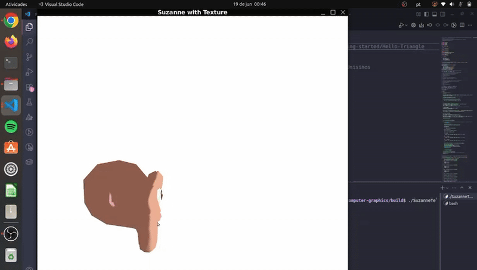

# Projeto de Computação Gráfica



## Instruções para rodar o executável

```bash
cmake ..
make
./SuzanneTexture
```


## Translação:

Eixo X: pressione A (esquerda) ou D (direita)

Eixo Z: pressione W (frente) ou S (trás)

Eixo Y: pressione I (cima) ou J (baixo)

## Escala:

Pressione H para aumentar

Pressione G para diminuir

## Rotação:

Pressione X, Y ou Z para rotacionar nos respectivos eixos