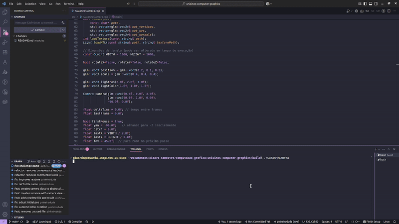

# Projeto de Computação Gráfica



## Instruções para rodar o executável

```bash
cmake ..
make
./SuzanneTexture
```


## Controle da Câmera (movimento pela cena):

W: mover para frente

S: mover para trás

A: mover para a esquerda

D: mover para a direita

Setas do mouse: olhar em volta (girar a câmera)


## Rotação:

Pressione X, Y ou Z para rotacionar nos respectivos eixos

## Iluminação:

Pressione R para iluminar de rosa e P para redefinir para a iluminação inicial